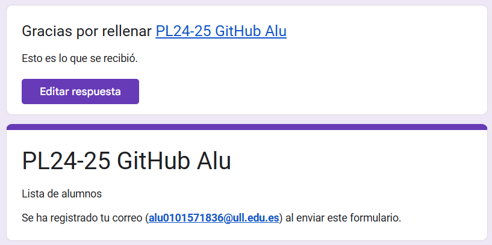
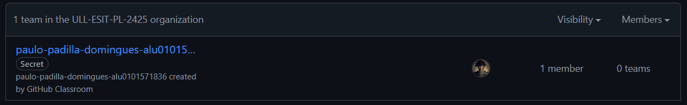
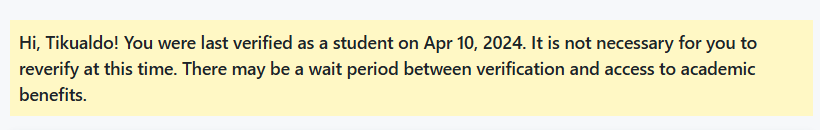

# Github Campus Expert 

- Paulo 
- Padilla Domingues 
- alu0101571836

## Rellenar el cuestionario GitHub-Alu del campus virtual y recibir el correo confirmándolo

## Crear equipo con nombre correcto

## Crear un project board kanban para este repositorio

## Solicitar el GitHub Backpack
En mi caso ya había hecho la solicitud en otra ocasión.

